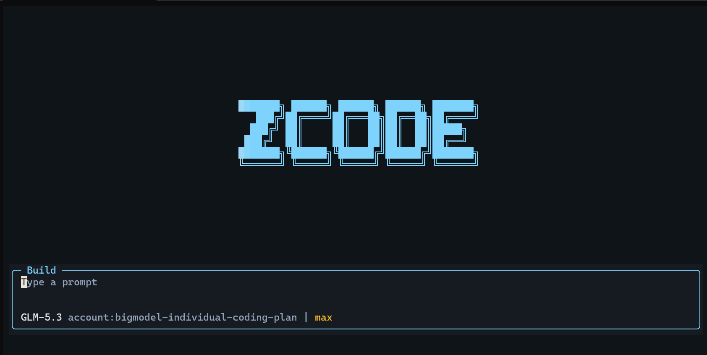

# zcode-tui



基于 [zai-org/ZCode](https://github.com/zai-org/ZCode) 的 **纯 TUI / CLI 定制版**：只关心终端里的 `zcode`——Agent CLI、全屏 TUI、子代理与多智能体编排。桌面端（Electron）代码已整体剔除，仓库只保留 TUI/CLI 及其依赖闭包（web/server 源码保留，构建链完整）。

相对上游新增 / 修改的内容：

- **AgentSwarm 工具**（批量并行子代理）：一次调用按 `prompt_template + items` 批量 fan-out 最多 128 个子代理，带断点续跑、每子代理超时、限速退避重试与启动节流
- **TUI swarm 显示**：工具调用行渲染为 `swarm (N subagents)` 分组卡片，附 items 预览与续跑计数；子代理沿用侧边栏 Subagents 区（点击可看 transcript）
- **ACP 编辑器集成（`zcode acp`）**：以 Agent Client Protocol agent 身份服务 stdio，Zed 等 ACP 客户端直接驱动——思考流/正文流/工具调用/用量全量回传，阻塞式 prompt 完成语义
- **SSH 远程工作区（`zcode connect`）**：从桌面版迁移的远程工作区能力——agent 与文件改动都发生在远端机器，本地终端只承载交互；`--deploy` 可把当前 CLI 单文件产物自动部署到远端
- **Windows 中文乱码修复**：GBK 代码页的控制台在启动时自动切到 UTF-8（仅 win32 + TTY 生效，不影响其他平台）

## 快速开始

要求：Node `>= 24`，pnpm `>= 10`。

```bash
git clone git@github.com:Vlary/zcode-tui.git
cd zcode-tui
pnpm install                # .npmrc 的 node-linker=hoisted 是硬前提，勿改
cd apps/zcode-cli
npx turbo run build
node packages/cli/dist/zcode.cjs --version
```

日常使用建议加个别名（PowerShell profile）：

```powershell
function zcode { node E:\path\to\zcode-tui\apps\zcode-cli\packages\cli\dist\zcode.cjs @args }
```

不带参数启动即进入全屏 TUI；`zcode tui` 同义。首次使用先 `zcode login`：

- 国内 BigModel Coding Plan：`zcode login bigmodel`
- 国际站 Z.AI：`zcode login zai`

开发模式（源码热跑，免打包）：在 `apps/zcode-cli` 下执行 `pnpm cli:dev`。

## AgentSwarm 用法

适合「同类任务 × 大量不同输入」：一份模板，N 个子代理并行，结果聚合成单份简报返回。

```json
AgentSwarm({
  "description": "review core files",
  "prompt_template": "Review {{item}} for likely regressions and report findings.",
  "items": ["src/a.ts", "src/b.ts", "src/c.ts"]
})
```

- `items`：2~128 个（传 `resume_agent_ids` 时可少于 2 或省略）；模板必须含 `{{item}}` 占位符；展开后的 prompt 必须互不相同
- `resume_agent_ids`：`{ "agent_id": "continue" }` 形式，续跑失败或超时（`stop_reason="timeout"`）的子代理，可与新 items 混跑
- `subagent_type`：子代理类型，缺省 `general-purpose`

引擎行为（对齐同类 swarm 实现）：并发默认 8、启动节流前 5 个每 700ms 放行、限速错误（429 / rate limit / quota）指数退避重试（3s 起、2 倍率、60s 封顶、至多 3 次）、每子代理超时默认 10 分钟。

环境变量：

| 变量 | 默认 | 说明 |
| --- | --- | --- |
| `ZCODE_SWARM_MAX_CONCURRENCY` | `8` | swarm 并发上限（最大 32） |
| `ZCODE_SWARM_TIMEOUT_MS` | `600000` | 单个子代理执行超时 |

与相邻工具的分工：少量异构任务用 `Agent`（一条消息多个调用并行）；需要类型化结果、循环、gate 的复杂编排用 `CreateWorkflow` 写 TS 脚本；大批量同构任务用 `AgentSwarm`。

## ACP 支持（编辑器集成）

`zcode acp` 以 ACP（Agent Client Protocol，Zed 主推的开放标准）agent 身份服务 stdio，Zed 等任何 ACP 客户端可直接驱动本 CLI。桥接层把 ACP 的会话与请求流翻译为内部 ZCode Protocol（自动拉起 `app-server` 子进程），并回传思考流、正文流、工具调用与用量更新；`session/prompt` 遵循 ACP 完成语义——阻塞到 turn 结束返回 `stopReason`。基于官方 `@agentclientprotocol/sdk`。

```json
// Zed settings.json → agent settings
{
  "name": "zcode",
  "command": { "path": "node", "args": ["/path/to/zcode.cjs", "acp"] }
}
```

## SSH 远程工作区（connect）

对齐桌面版「远程工作区」的语义：agent 与文件改动都发生在远端机器，本地终端只承载交互。

```bash
zcode connect vlary@192.168.3.21:22:/home/vlary/WorkSpace   # 直连并进入远端 TUI
zcode connect vlary@server --deploy                          # 远端没装 zcode 时先推送 CLI
```

目标语法 `[user@]host[:port][:/remote/path]`。实现零新增依赖：用系统 ssh 以 PTY 直通在远端目标目录启动 zcode；`--deploy` 通过 scp 把当前 CLI 单文件产物安装到远端 `~/.local/bin/zcode`。连接检查阶段使用 `BatchMode` 防止密码认证时挂死，最终直通阶段保持交互（可输密码）。

## 目录结构（TUI/CLI 相关）

```
apps/zcode-cli/
  packages/cli        # CLI 入口：参数解析、登录、打包（单文件 zcode.cjs）
  packages/tui        # 全屏 TUI（OpenUI/React 终端渲染，含 swarm 投影）
  packages/core       # Agent 运行时与工具注册表（AgentSwarm 在 tool/handlers/）
  packages/bootstrap  # 启动装配、登录流程
  packages/contracts  # 跨包契约（AgentSwarm schema 在 tools/）
  packages/adapters   # OAuth / HTTP / 凭据存储适配
packages/             # 根工作区共享包（shared、provider、rpc 等，CLI 依赖闭包）
```

## 与上游的关系

Fork 自 [zai-org/ZCode](https://github.com/zai-org/ZCode)（Apache-2.0），在其开源 commit 之上叠加本仓库的 TUI/CLI 定制。上游的 LICENSE、NOTICE、THIRD-PARTY-NOTICES 均完整保留。感谢 Z.ai 团队的开源工作。
